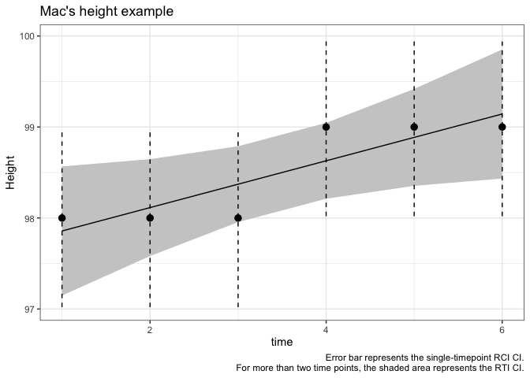

<!-- README.md is generated from README.Rmd. Please edit that file -->

# ReliableTrendIndex

<!-- badges: start -->
<!-- badges: end -->

An R package for analysis of “reliable” changes.

PLEASE DO NOT USE RELIABLE CHANGE OR THIS PACKAGE FOR ANYTHING WITH
MEANINGFUL CONSEQUENCES.

The idea of reliable change is extremely questionable, and there are
almost certainly better ways to investigate the questions in which you
are interested.

The goal of this package is to provide a simple interface for computing
the RCI and RTI given a data set. I intend it for my own personal use
and as an educational/demonstration tool in this ongoing research
endeavor.

## Installation

I don’t recommend installing this package. I am providing it publicly
because it should be available to everyone who is interested in these
issues, to discover strengths and weaknesses of this framework.

You can install the development version of ReliableTrendIndex from
[GitHub](https://github.com/) with:

``` r
# install.packages("devtools")
devtools::install_github("andrewmcaleavey/ReliableTrendIndex")
```

## Usage

You could use this package just to have a standard way to access RCI and
RTI-like functions. They’re not complex, other packages exist that
compute them, but it is easier to have them in one standard format than
bother with always having to re-write these functions with varying
levels of stability on a per-project basis.

I repeat, however, that *I don’t really think these functions should be
used for any clinically-meaningful application* except with extreme
caution. The idea of “reliable” change is questionably justified and has
a strong tendency to confuse or mislead users.

Bugs and issues can be reported at [the GitHub
repo](https://github.com/andrewmcaleavey/ReliableTrendIndex). If anyone
would like to contribute, please be in touch!

## Example

``` r
library(ReliableTrendIndex)
#> Loading required package: dplyr
#> 
#> Attaching package: 'dplyr'
#> The following objects are masked from 'package:stats':
#> 
#>     filter, lag
#> The following objects are masked from 'package:base':
#> 
#>     intersect, setdiff, setequal, union
#> Loading required package: magrittr
#> Warning: package 'magrittr' was built under R version 4.0.5
#> 
#> You loaded ReliableTrendIndex
#> You don't actually believe that the SD of a group has anything to do with any individual case, right?
#> That seems implausible for most constructs.
```

### One person RCI

To calculate the RCI for an individual, we can do the following:

``` r
## here is the example case provided by Jacobson & Truax (1991): 
knitr::kable(jt_example_data_1)
```

|  obs | time |
|-----:|-----:|
| 47.5 |    0 |
| 32.5 |    1 |

We will use that data to compute a simple RCI.

The difference score for this person is `47.5 - 32.5`, or `15`.

The scale’s standard error of the difference score, as computed by the
authors, is `4.74`.

``` r
jt_rci_calc(difference = 15, sdiff = 4.74)
#> [1] 3.164557
```

That value, 3.16, is the person’s RCI, according to Jacobson & Truax.
Since it is greater than their suggested cutpoint of 1.96 (which conveys
5% chance of Type I error under the assumptions of the RCI), we would
conclude that this change is “reliable.”

### One person RTI

If we had assessed a person more than twice, it would be nice to
incorporate all of the information we have about them, rather than just
the first and last (or any two observations in isolation). For the
purpose of an example, we will use the fabricated height data from
McAleavey (2022).

``` r
knitr::kable(mac_height)
```

| obs | time |
|----:|-----:|
|  98 |    1 |
|  98 |    2 |
|  98 |    3 |
|  99 |    4 |
|  99 |    5 |
|  99 |    6 |

That data shows a difference score of `1` cm. From the example text, we
know that the standard error of the difference is `.7071068`.

We could simply compute the RCI for this individual by using their first
and last observations, which is commonly done in routine care and
clinical trials analysis of clinically significant change:

``` r
jt_rci_calc(difference = 1, sdiff = .7071068)
#> [1] 1.414214
```

That value, 1.414, is not greater than 1.96, so we would conclude that
the change from pre-post is not reliable. The `ReliableTrendIndex` term
for this is `Unspecified` as opposed to `No Change` in order to indicate
that the method could not specifically identify the change score.

However, the RTI would incorporate all six measurements. It is a waste
to ignore two-thirds of our information here. In its most simple form,
the RTI takes the RCI’s observed difference score question (How likely
is this difference score, if the true change was actually 0?) and
extends it to the overall sequence of scores (How likely is this
sequence of scores if the true linear trend was actually 0?).

To use `rti_calc_simple()` we need the observations as a vector and the
*squared* standard error of the difference.

``` r
mac_rti <- rti_calc_simple(mac_height$obs, .7071068^2)
#> [1] "More than two values provided, assuming they are evenly spaced in time."
```

Note that it gave us this message on screen:
`"More than two values provided, assuming they are evenly spaced in time."`.
The function `rti_calc_simple()` is meant to be *simple*, so it is not
meant to be used with uneven assessment spacing. Other methods allow
more flexibility at the cost of increase complexity.

The object `mac_rti` is of the class `reliableTrend`. It contains a lot
of information and can be viewed with `print.reliableTrend()` (which is
also called by just the object name):

``` r
print(mac_rti)
#> $RCI
#> [1] NA
#> 
#> $RTI
#> [1] 2.151411
#> 
#> $pd.RCI
#> numeric(0)
#> 
#> $pd.RTI
#> numeric(0)
#> 
#> $category.RTI
#> [1] "Reliable Increase"
#> 
#> $category.RCI
#> [1] "Unspecified"
#> 
#> $sign.RTI
#> [1] "Not calculated"
#> 
#> $sign.difference
#> [1] "Not calculated"
#> 
#> $values
#> [1] 98 98 98 99 99 99
#> 
#> $values.prepost
#> [1] 98 99
#> 
#> $error_var
#> [1] 0.5
#> 
#> $cutpoint
#> [1] 1.96
#> 
#> $observed
#> [1] "obs_score"
#> 
#> $scale_RCI
#> numeric(0)
#> 
#> $rmaObj
#> 
#> Fixed-Effects with Moderators Model (k = 6)
#> 
#> I^2 (residual heterogeneity / unaccounted variability): 0.00%
#> H^2 (unaccounted variability / sampling variability):   0.34
#> R^2 (amount of heterogeneity accounted for):            71.43%
#> 
#> Test for Residual Heterogeneity:
#> QE(df = 4) = 1.3714, p-val = 0.8491
#> 
#> Test of Moderators (coefficient 2):
#> QM(df = 1) = 4.6286, p-val = 0.0314
#> 
#> Model Results:
#> 
#>              estimate      se      zval    pval    ci.lb    ci.ub     ​ 
#> intrcpt       97.6000  0.4655  209.6784  <.0001  96.6877  98.5123  *** 
#> time_linear    0.2571  0.1195    2.1514  0.0314   0.0229   0.4914    * 
#> 
#> ---
#> Signif. codes:  0 '***' 0.001 '**' 0.01 '*' 0.05 '.' 0.1 ' ' 1
```

However, notice that several values there are missing or retained the
default values. This would be caught by the `summary()` method for
`reliableTrend` objects:

``` r
summary(mac_rti)
#> Warning in summary.reliableTrend(mac_rti): Only parts of this reliableTrend
#> object are valid. Do not trust the summary.
#> 
#> Reliable Trend Analysis:
#> 
#> This sequence of 6 values has a Reliable Increase using the RTI.
#> A pre-post analysis would have an Unspecified difference using the RCI.
```

Because of this, I recommend using the `summary()` function when
possible.

To fill in the missing values (and properly calculate the RTI and RCI
comparison), call `reliableTrend()` on the `rmaObj` variable of
`mac_rti`:

``` r
mac_rti <- reliableTrend(mac_rti$rmaObj)
summary(mac_rti)
#> 
#> Reliable Trend Analysis:
#> 
#> This sequence of 6 values has a Reliable Increase using the RTI.
#> A pre-post analysis would have an Unspecified difference using the RCI.
```

So now we can clearly see that the RCI, if ignoring the interim
measurements, would not detect a reliable change, but the RTI would.

To see the details:

``` r
print(mac_rti)
#> $RCI
#> [1] 1.414213
#> 
#> $RTI
#> [1] 2.151411
#> 
#> $pd.RCI
#> [1] 0.9213504
#> 
#> $pd.RTI
#> [1] 0.9842781
#> 
#> $category.RTI
#> [1] "Reliable Increase"
#> 
#> $category.RCI
#> [1] "Unspecified"
#> 
#> $sign.RTI
#> [1] "Increase"
#> 
#> $sign.difference
#> [1] "Increase"
#> 
#> $values
#> [1] 98 98 98 99 99 99
#> 
#> $values.prepost
#> [1] 98 99
#> 
#> $error_var
#> [1] 0.25
#> 
#> $cutpoint
#> [1] 1.96
#> 
#> $observed
#> [1] "obs_score"
#> 
#> $scale_RCI
#> [1] 0.9800001
#> 
#> $rmaObj
#> 
#> Fixed-Effects with Moderators Model (k = 6)
#> 
#> I^2 (residual heterogeneity / unaccounted variability): 0.00%
#> H^2 (unaccounted variability / sampling variability):   0.34
#> R^2 (amount of heterogeneity accounted for):            71.43%
#> 
#> Test for Residual Heterogeneity:
#> QE(df = 4) = 1.3714, p-val = 0.8491
#> 
#> Test of Moderators (coefficient 2):
#> QM(df = 1) = 4.6286, p-val = 0.0314
#> 
#> Model Results:
#> 
#>              estimate      se      zval    pval    ci.lb    ci.ub     ​ 
#> intrcpt       97.6000  0.4655  209.6784  <.0001  96.6877  98.5123  *** 
#> time_linear    0.2571  0.1195    2.1514  0.0314   0.0229   0.4914    * 
#> 
#> ---
#> Signif. codes:  0 '***' 0.001 '**' 0.01 '*' 0.05 '.' 0.1 ' ' 1
```

That will give the full information. However, note that the re-analysis
changed `mac_rti$values` to deviation-from-first-observation scores
rather than raw scores (and inserted a leading 0 for the first
observation). This should not have dire consequences but must be
carefully examined, and if the observed scores are important, altering
this behavior is possible.

You might want to visualize this to see what it’s doing. Try
`forest_to_reg_plot()`.

``` r
forest_to_reg_plot(mac_rti$rmaObj, 
                   StError = sqrt(mac_rti$error_var)) +
  ggplot2::labs(title = "Mac's height example",
         y = "Height difference from baseline")
```



Notice that the trend line is going up, and the 95% CI for the RTI
(shaded region) is more precise than the 95% CI for individual
observations (error bars), which is what the RCI on its own does.

## Analysis of complete data sets

More complete functions to analyze a complete data set are also provided
in the function documentation and an initial
`vignette("Introduction_to_ReliableTrendIndex")`. Complete documentation
to come!

## License

This package is licensed under the GNU Affero General Public License
(AGPL) 3.
