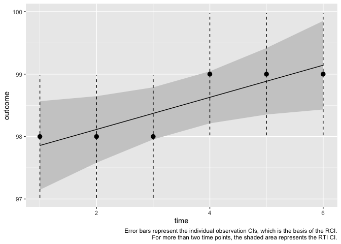

<!-- README.md is generated from README.Rmd. Please edit that file -->

# ReliableTrendIndex

<!-- badges: start -->
<!-- badges: end -->

An R package for analysis of the reliability of changes.

## What is a reliable change?

The idea of a reliable change is that some sequences of scores, which
appear to show change (*observed* changes), do not reflect *true*
changes. Usually, these sequences of scores are just a sequence of two
scores, simplified to a difference score. The point of the
ReliableTrendIndex package is that in principle, these sequences can be
any length. Regardless of the length of the sequence of observations,
only *true* changes matter, in this theory, and anything that is
observed but not true change should be treated as if it is noise.

If you want to identify reliable changes, you are interested in
separating those sequences of scores that contain true change from
sequences that do not contain true changes. You cannot do this with
perfect accuracy. You can only estimate likelihoods of underlying true
change states: most commonly, the chance that the observations could
occur if there was no true change at all.

The reliable change index (RCI) separates difference scores based on the
chance that a difference at least as large as the observed one could be
due to chance alone. It uses an estimate of measurement error from
external data to evaluate this. Since the RCI only pertains to a
difference score, it only accommodates two observation sequences. This
is a limitation if you have more than one observation, since it will
ignore the additional observations.

The reliable trend index (RTI) looks for reliability of trends, rather
than change scores. That is, it takes all data points and compares the
line of best fit to a perfectly unchanging line. It uses the same
estimate of measurement error as the RCI (and therefore, if you don’t
trust that estimate, don’t use either the RCI or RTI).

Both the RCI and RTI ask the question: “How likely is this sequence of
scores if there is no true change in my data?” The central difference is
that the RCI is a two-timepoint instance of the more general RTI.

## Package goals

The goal of this package is to provide a simple interface for computing
the RCI and RTI given a data set. I intend it for my own personal use
and as an educational/demonstration tool in this ongoing research
endeavor.

If you are interested in contributing to this work in any way (including
by pointing out mistakes or providing counterarguments), please get in
touch with me: [@andrewathan](https://twitter.com/andrewathan) or
[GitHub](https://github.com/andrewmcaleavey/ReliableTrendIndex).

I think the RTI is demonstrably better as an operationalization of
reliable change than the RCI in almost any case with more than 2 data
points. With two data points, it simplifies to the RCI. The chief added
assumption with more time points is that linear change is a reasonably
approximation of the true change (not that the path of scores is linear
*per se*). So you have to be interested in an overall tendency to
increase or decrease over the course of your observation period.

Nonlinearity of the true change process will make the RTI less
sensitive, but still more accurate than the RCI. The RCI does not
explicitly pay a penalty for nonlinear changes, it also fails to
identify them either. If nonlinearity is a serious concern, the RCI will
not be useful due to this reason.

In general, it is not my opinion that the RTI solves all of the RCI’s
problems. There are many reasons not to be interested in reliable
changes at all. But if you are, the RTI should be a usable solution.

## Installation

I am providing this package publicly because it should be available to
everyone who is interested in these issues, to discover strengths and
weaknesses of this framework. Not because I think it is perfect. That
is, errors might be present.

You can install the development version of ReliableTrendIndex from
[GitHub](https://github.com/) with:

``` r
# install.packages("devtools")
devtools::install_github("andrewmcaleavey/ReliableTrendIndex")
```

## Usage

You could use this package just to have a standard way to access RCI and
RTI-like functions. They’re not complex, and other packages exist to
compute them. But it is easier to have them in one standard format than
bother with always having to re-write these functions with varying
levels of stability on a per-project basis, and putting them together
will clarify their similarities.

However, *this package should be used with caution*. The idea of
“reliable” change is questionably justified and has a strong tendency to
confuse or mislead. Plus, mistakes may exist, so it is provided as-is.

Bugs and issues can be reported at [the GitHub
repo](https://github.com/andrewmcaleavey/ReliableTrendIndex). If anyone
would like to contribute, please be in touch!

## Definition

Jacobson & Truax defined the RCI as $$RC = \frac{x_2 - x_1}{S_{diff}}$$
The term $x_2 - x_1$ is the observed change, which is treated as an
unbiased estimate of true change. $S_{diff}$ is the standard error of
the difference score, the appropriate error term for a difference score
if the assumptions of the model are accurate. Notably, this is based on
data external to the person in question.

The RTI is defined as $$RT = \frac{b}{s_{e}}$$ Here, $b$ is the linear
time effect (slope) estimate from a regression of all available data
points and $s_{e}$ is the appropriate standard error for that slope,
estimated from external data and using the same assumptions as the RCI.
However, $s_{e}$ will be smaller than $S_{diff}$ as a function of the
number of observations. The logic of this is that the more observations
of a series, the less likely a random series is to have a notably
increasing or decreasing linear trend so the plausible error decreases.

Note that the definition of the RTI is also more obviously
model-sensitive than the RCI, because more data points means more
options for models (the RCI is model-dependent as well, but its model
makes intuitive sense given a difference score). Depending on the number
of observations, the RTI will be defined differently:

- **For 2 observations**, the RTI is the same as the RCI. To compute a
  linear regression, the RTI as implemented here treats both
  observations and the difference score as fixed values. This means that
  the slope of the best fitting line must cross through both
  observations. Put differently, the best available estimate of $b$ is
  simply $x_2 - x_1$. The standard error of a difference score
  ($S_{diff}$) is the appropriate standard error for this case. Thus,
  the entire model simplifies to the RCI.  
- **For 3 observations**, there are two options. We could treat all
  three observations as fixed, but this means that there is no gain from
  the RTI compared to the RCI. The model will simply take the first and
  last observation, which is equivalent to the RCI. Instead, by default,
  the RTI treats the intercept as fixed but estimates a slope using the
  other observations. This allows for uncertainty in the slope
  estimation, though it implies that slope comes from an
  unrealistically-accurately measured first observation. The slope will
  not differ if a different point were chosen as the fixed point.  
- **For 4 or more observations**, the RTI estimates both a slope and
  intercept. This should be the most generalizable method for trend
  identification. It does not prioritize any given observation(s),
  treating them all with equal potential error. This does mean that the
  slope will likely not pass directly through any specific observations:
  the most likely true state will be estimated to not coincide with the
  observations, because those observations have error.

## Example

``` r
library(ReliableTrendIndex)
#> Loading required package: dplyr
#> 
#> Attaching package: 'dplyr'
#> The following objects are masked from 'package:stats':
#> 
#>     filter, lag
#> The following objects are masked from 'package:base':
#> 
#>     intersect, setdiff, setequal, union
#> Loading required package: ggplot2
#> Loading required package: magrittr
#> 
#> You loaded ReliableTrendIndex
#> Think about your choices: would you rather develop a meaningful clinical test?
#> Or is reliability really the best possible idea?
```

### One person RCI

To calculate the RCI for an individual, we can do the following:

``` r
## here is the example case provided by Jacobson & Truax (1991): 
knitr::kable(jt_example_data_1)
```

|  obs | time |
|-----:|-----:|
| 47.5 |    0 |
| 32.5 |    1 |

We will use that data to compute a simple RCI.

The difference score for this person is `47.5 - 32.5`, or `15`.

The scale’s standard error of the difference score, as computed by the
authors, is `4.74`.

``` r
jt_rci_calc(difference = 15, sdiff = 4.74)
#> [1] 3.164557
```

That value, 3.16, is the person’s RCI, according to Jacobson & Truax.
Since it is greater than their suggested cutpoint of 1.96 (which conveys
5% chance of Type I error under the assumptions of the RCI), we would
conclude that this change is “reliable.”

### One person RTI

If we had assessed a person more than twice, it would be nice to
incorporate all of the information we have about them, rather than just
the first and last (or any two observations in isolation). For the
purpose of an example, we will use the fabricated height data from
McAleavey (2022).

``` r
knitr::kable(mac_height)
```

| obs | time |
|----:|-----:|
|  98 |    1 |
|  98 |    2 |
|  98 |    3 |
|  99 |    4 |
|  99 |    5 |
|  99 |    6 |

That data shows a difference score of `1` cm. From the example text, we
know that the standard error of the difference is `.7071068` and the
standard error of measurement is `0.5`.

We could simply compute the RCI for this individual by using their first
and last observations, which is commonly done in routine care and
clinical trials analysis of clinically significant change:

``` r
jt_rci_calc(difference = 1, sdiff = .7071068)
#> [1] 1.414214
```

That value, 1.414, is not greater than 1.96, so we would conclude that
the change from pre-post is not reliable. The `ReliableTrendIndex` term
for this is `Less than reliable` as opposed to `No Change` in order to
indicate that the method could not specifically identify the change
score.

However, the RTI would incorporate all six measurements. It is a waste
to ignore two-thirds of our information here.

In its most simple form, the RTI takes the RCI’s observed difference
score question (How likely is this difference score, if the true change
was actually 0?) and extends it to the overall sequence of scores (How
likely is this sequence of scores if the true linear trend was actually
0?).

The simplest function to use for a single person - whether computing the
RCI and/or RTI - is `rti()`.

``` r
mac_rti <- rti(mac_height$obs, sdiff = .707)
#> More than two values provided, assuming they are evenly spaced in time.
```

Note that it gave us this message on screen:
`"More than two values provided, assuming they are evenly spaced in time."`.
The function `rti()` is meant to be *simple*, so it is not meant to be
used with uneven assessment spacing. Other methods allow more
flexibility at the cost of increase complexity.

The object `mac_rti` is of the class `reliableTrend`. It contains a lot
of information and can be viewed with `print.reliableTrend()` (which is
also called by just the object name):

``` r
print(mac_rti)
#> $RCI
#> [1] 1.414427
#> 
#> $RTI
#> [1] 2.151736
#> 
#> $pd.RCI
#> [1] 0.9213817
#> 
#> $pd.RTI
#> [1] 0.9842909
#> 
#> $category.RTI
#> [1] "Reliable Increase"
#> 
#> $category.RCI
#> [1] "Less than reliable"
#> 
#> $sign.RTI
#> [1] "Increase"
#> 
#> $sign.difference
#> [1] "Increase"
#> 
#> $values
#> [1] 98 98 98 99 99 99
#> 
#> $values.prepost
#> [1] 98 99
#> 
#> $error_var
#> [1] 0.4999245
#> 
#> $cutpoint
#> [1] 1.96
#> 
#> $observed
#> [1] "obs_score"
#> 
#> $scale_RCI
#> [1] 1.38572
#> 
#> $rmaObj
#> 
#> Fixed-Effects with Moderators Model (k = 6)
#> 
#> I^2 (residual heterogeneity / unaccounted variability): 0.00%
#> H^2 (unaccounted variability / sampling variability):   0.34
#> R^2 (amount of heterogeneity accounted for):            71.43%
#> 
#> Test for Residual Heterogeneity:
#> QE(df = 4) = 1.3718, p-val = 0.8491
#> 
#> Test of Moderators (coefficient 2):
#> QM(df = 1) = 4.6300, p-val = 0.0314
#> 
#> Model Results:
#> 
#>              estimate      se      zval    pval    ci.lb    ci.ub      
#> intrcpt       97.6000  0.4654  209.7101  <.0001  96.6878  98.5122  *** 
#> time_linear    0.2571  0.1195    2.1517  0.0314   0.0229   0.4914    * 
#> 
#> ---
#> Signif. codes:  0 '***' 0.001 '**' 0.01 '*' 0.05 '.' 0.1 ' ' 1
```

An additional text summary can be found using `summary()`.

``` r
summary(mac_rti)
#> 
#> Reliable Trend Analysis:
#> 
#> This sequence of 6 values has a Reliable Increase using the RTI.
#> The likelihood of an overall Increase in true score is 0.98429 using the RTI.
#> 
#> A pre-post analysis would have a Less than reliable change using the RCI.
#> The likelihood of Increase given just the pre-post values is 0.92138.
```

So now we can clearly see that the RCI, by ignoring the interim
measurements and using a strong cutoff, would not detect a reliable
change but the RTI would. Note that the summary also tells us the
probability of the result being in its most likely direction. It is not
uncommon for large probabilities like 80-90% to be considered
“Unreliable” due to the conservative Type I error approach of the RCI.

You might want to visualize this to see what it’s doing. Try
`plot.reliableTrend()` (or just `plot()`).

``` r
plot(mac_rti) 
```



Notice that the trend line is going up, and the 95% CI for the RTI
(shaded region) is more precise than the 95% CI for individual
observations (error bars), which is what the RCI on its own relies on.

The output of `plot.reliableTrend()` is a `ggplot2` object, so you can
modify it in that ecosystem:

``` r
plot(mac_rti) +
  ggplot2::labs(title = "Mac's height example",
                y = "Height", 
                x = "Occasion") +
  ggplot2::theme_dark()
```


## Analysis of complete data sets

More complete functions to analyze a complete data set are also provided
in the function documentation and an initial
`vignette("Introduction_to_ReliableTrendIndex")`. Complete documentation
to come.

## License

This package is licensed under the GNU Affero General Public License
(AGPL) 3.
